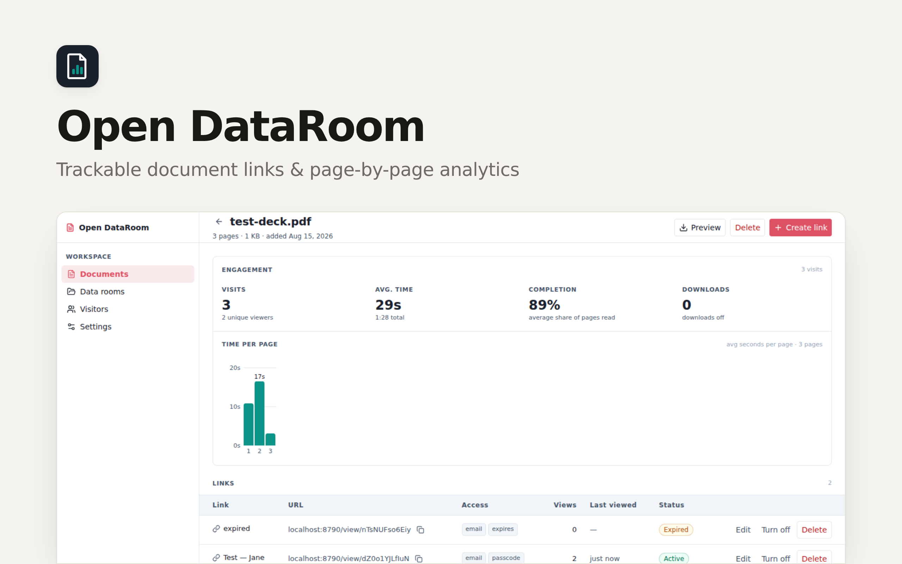

<p align="center">
  <picture>
    <source media="(prefers-color-scheme: dark)" srcset="./readme-banner-dark.png">
    
  </picture>
</p>

# OpenDataRoom

**The document-sharing app your AI employee runs.** It sends the deck, watches
who reads it — page by page — and messages you when it matters: *"Sequoia just
opened the Series B deck. They spent four minutes and stopped on page 7."*
An open-source alternative to DocSend, operated by your agent end to end (and
perfectly usable by hand in the dashboard).

## What it does

- **Agent-operated** — a clean JSON API with OpenAPI discovery: your agent
  uploads the deck, mints a link with the right gates, sends it, and reports
  back who read what. You ask "did Jane open it?" in chat; it answers with the
  numbers.
- **Visit notifications** — flip *notify* on a link and every visit lands with
  your agent as a task, so the "Sequoia just opened it" message reaches you on
  your usual channel while the reader is still on the page.
- **Trackable links** — every link carries its own gates and its own
  analytics. Name one per recipient ("Sequoia — Jane") and engagement stays
  attributable.
- **Gates** — email capture (on by default), allow/deny lists per email or
  domain, passcode, an NDA/agreement checkbox, expiry, and an on/off switch
  that keeps the analytics when you turn a link off.
- **Page-by-page analytics** — average reading time per page, visit duration,
  completion, downloads. See the exact page where readers stop.
- **Watermarking** — tile the viewer's email across every page as a visible
  deterrent.
- **Data rooms** — bundle documents into folders behind one link, with a
  branded cover (your logo, company name and accent color).
- **Visitors** — everything one email address has viewed, across all links.

## Stack

- [Hono](https://hono.dev) API + [React](https://react.dev) dashboard, built
  with [Vite](https://vite.dev) and [Tailwind CSS](https://tailwindcss.com)
- SQLite for links, visits and page-level timings; object storage for the
  files
- PDF page counts read server-side with [unpdf](https://github.com/unjs/unpdf);
  the viewer renders pages client-side with
  [PDF.js](https://mozilla.github.io/pdf.js/)

## Develop

```bash
pnpm install
pnpm dev        # UI on :5173, API on :8790
pnpm test       # gate logic (email/passcode/expiry) unit tests
pnpm typecheck
```

## Deploy with Clawnify

[](https://app.clawnify.com/deploy?repo=clawnify/open-dataroom)

One click provisions the app with its database and storage, wires it to your
AI employee, and serves it on your own URL. From then on you just say "send
the deck to jane@fund.vc" — the agent shares it, watches the read, and tells
you how it went.

## License

[MIT](LICENSE)
